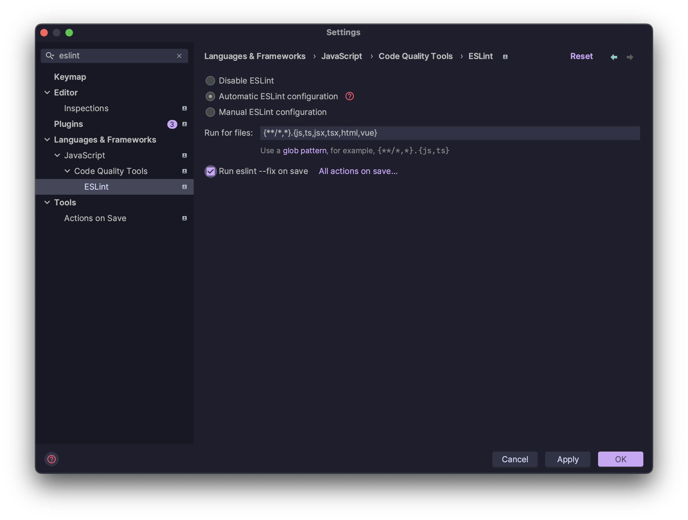
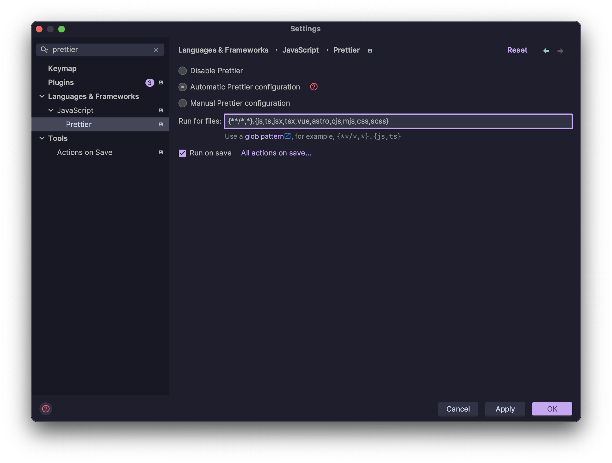
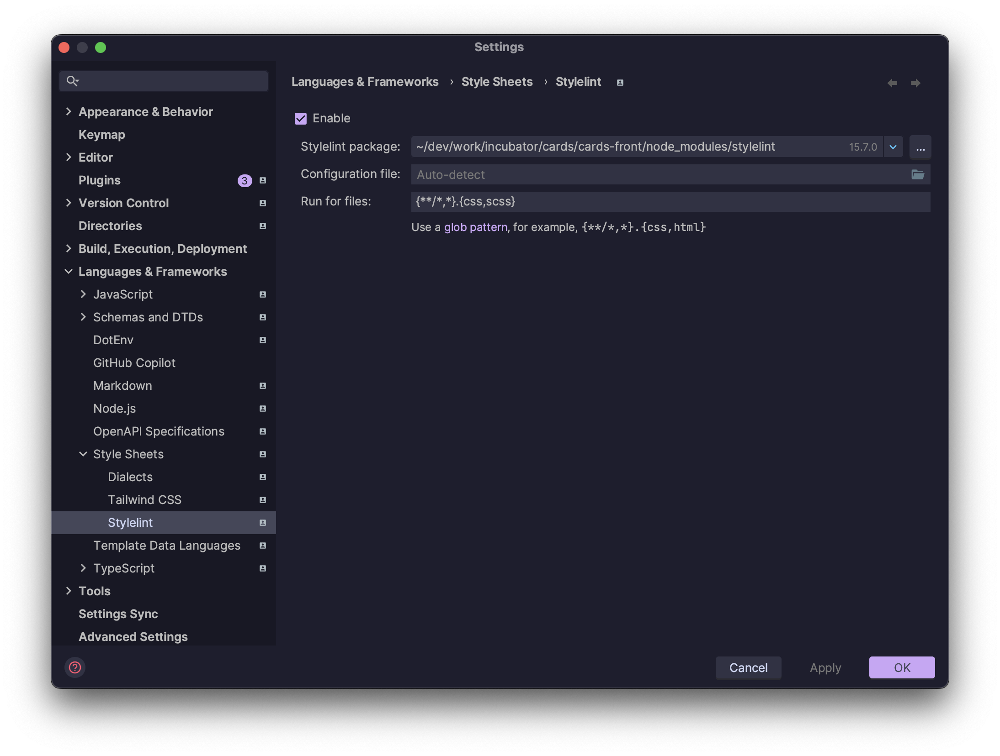
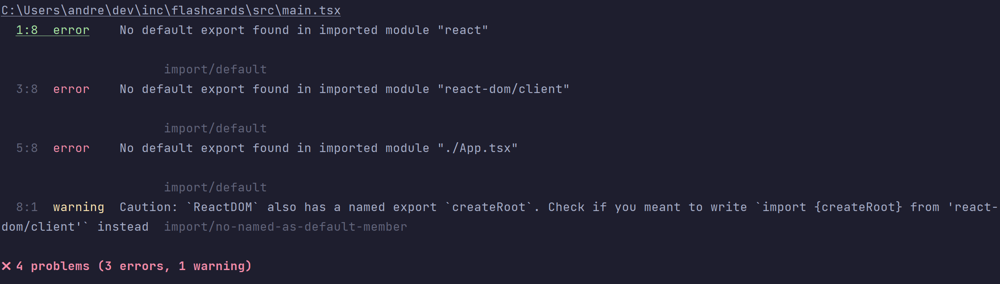
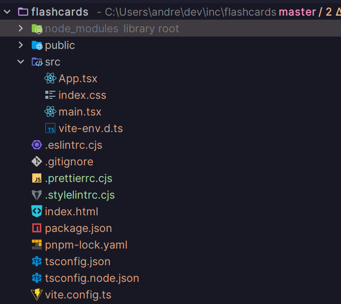

import { Callout } from 'nextra/components'
import { DownloadLink } from '../../components'

# 1. Создание и настройка проекта

## Vite

Мы будем использовать [Vite](https://vitejs.dev/) в качестве сборщика.

```bash filename="Terminal"
pnpm create vite
```

- Выберите название для проекта на ваш вкус
- Фреймворк - React
- Тип приложения - TypeScript

<Callout type={'warning'}>
  После создания проекта не забудьте установить зависимости, используя <code>pnpm i</code>
</Callout>

## Инициализация git

В отличие от create-react-app, vite не инициализирует git репозиторий автоматически, поэтому нам нужно сделать это вручную:

```bash filename="Terminal"
git init
```

## Установка зависимостей

### Linters

Мы будем использовать линтеры от команды IT-Incubator:

```bash filename="Terminal"
pnpm i @it-incubator/eslint-config @it-incubator/prettier-config @it-incubator/stylelint-config stylelint -D
```

### SASS

Мы будем использовать SASS в качестве препроцессора стилей:

```bash filename="Terminal"
pnpm i sass -D
```

## Конфигурация линтеров

### Prettier

Создайте файл .prettierrc.cjs в корне проекта и скопируйте туда следующее содержимое:

```js filename=".prettierrc.cjs"
module.exports = {
  ...require('@it-incubator/prettier-config'),
  //override settings here
}
```

### ESLint

Замените содержимое файла .eslintrc.cjs на следующее:

```js filename=".eslintrc.cjs"
module.exports = {
  extends: '@it-incubator/eslint-config',
  rules: { 'no-console': ['warn', { allow: ['warn', 'error'] }] },
}
```

### Stylelint

Создайте файл .stylelintrc.cjs в корне проекта и скопируйте туда следующее содержимое:

```js filename=".stylelintrc.cjs"
module.exports = {
  extends: '@it-incubator/stylelint-config',
}
```

## Конфигурация WebStorm

### Включить ESLint



### Включить Prettier

```bash
{**/*,*}.{js,ts,jsx,tsx,vue,astro,cjs,mjs,css,scss}
```



### Включить stylelint



### Включить автоматическое исправление ошибок при сохранении .css/.scss файлов

<DownloadLink href="./watchers.xml" />

После импорта получим следующее: 

### Добавить скрипты в package.json, перезаписывая значения по умолчанию при необходимости

```json lines filename="package.json"
{
  "scripts": {
    "format": "prettier --write src",
    "lint": "eslint --fix src/**/*.{tsx,ts,jsx,js} --no-error-on-unmatched-pattern && stylelint --fix src/{,*/}*.{scss,css} --allow-empty-input"
  }
}
```

### Убрать boilerplate

- Удалить файл App.css
- Удалить папку assets
- Заменить содержимое файла App.tsx на следующее:

```tsx filename="App.tsx"
export function App() {
  return <div>Hello</div>
}
```

### Запустить линтеры

- Prettier

```bash
pnpm run format
```

- Eslint и Stylelint

```bash
pnpm run lint
```

Некоторые ошибки eslint не исправляются автоматически, поэтому вам придется сделать это самостоятельно, например:


Постарайтесь разобраться сами, если не получится - замените содержимое файла main.tsx на следующее:

```tsx filename="main.tsx"
import './index.css'
import { StrictMode } from 'react'

import { createRoot } from 'react-dom/client'

import { App } from './App.tsx'

createRoot(document.getElementById('root') as HTMLElement).render(
  <StrictMode>
    <App />
  </StrictMode>
)
```

<Callout type={'warning'}>
  Наш eslint конфиг использует плагин import\/order, который требует, чтобы ваши файлы **css/scss
  были размещены либо первыми, либо последними в импортах** (см. пример выше), иначе вы получите
  неразрешимые ошибки.
</Callout>

## Итоговая структура папок

Так должна выглядеть структура папок к концу этой главы:


## Коммитим изменения

Не забудьте закоммитить изменения:

```bash filename="Terminal"
git add .
git commit -m "Initial commit"
```
