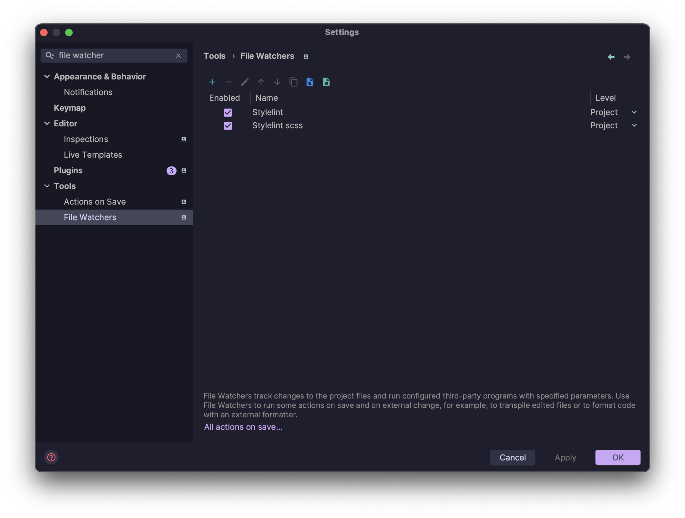

import { Callout } from 'nextra/components'
import { DownloadLink } from '../../components'
import { FileTree } from 'nextra-theme-docs'

# 1. Создание и настройка проекта

## Pnpm

```bash filename="Terminal"
npm i -g pnpm
```

## Vite

Мы будем использовать [Vite](https://vitejs.dev/) в качестве сборщика.

```bash filename="Terminal"
pnpm create vite
```

- Выберите название для проекта на ваш вкус
- Фреймворк - React
- Тип приложения - TypeScript

<Callout type={'warning'}>
  После создания проекта не забудьте установить зависимости, используя <code>pnpm i</code>
</Callout>

## Инициализация git

В отличие от create-react-app, vite не инициализирует git репозиторий автоматически, поэтому нам нужно сделать это вручную:

```bash filename="Terminal"
git init
```

## Установка зависимостей

### Linters

Мы будем использовать линтеры от команды IT-Incubator:

```bash filename="Terminal"
pnpm i @it-incubator/eslint-config @it-incubator/prettier-config @it-incubator/stylelint-config stylelint -D
```

### SASS

Мы будем использовать SASS в качестве препроцессора стилей:

```bash filename="Terminal"
pnpm i sass -D
```

## Конфигурация Alias'ов

### Конфигурация Vite

В файле vite.config.ts добавьте следующий код:

```ts filename="vite.config.ts"
import * as path from 'path'

export default defineConfig({
  plugins: [react()],
  resolve: {
    alias: [{ find: '@', replacement: path.resolve(__dirname, 'src') }],
  },
})
```

Установим типы для nodejs что бы не было ошибок в vite.config.ts

```bash filename="Terminal"
pnpm i @types/node -D
```

### Конфигурация TypeScript

```json filename="tsconfig.json" showLineNumbers {11,22-25}
{
  "compilerOptions": {
    "target": "ES2020",
    "useDefineForClassFields": true,
    "lib": ["ES2020", "DOM", "DOM.Iterable"],
    "module": "ESNext",
    "skipLibCheck": true,

    /* Bundler mode */
    "moduleResolution": "bundler",
    "allowImportingTsExtensions": false,
    "resolveJsonModule": true,
    "isolatedModules": true,
    "noEmit": true,
    "jsx": "react-jsx",

    /* Linting */
    "strict": true,
    "noUnusedLocals": true,
    "noUnusedParameters": true,
    "noFallthroughCasesInSwitch": true,
    "types": ["node"],
    "paths": {
      "@/*": ["./src/*"]
    }
  },
  "include": ["src"],
  "references": [{ "path": "./tsconfig.node.json" }]
}
```

### Использование

Теперь вы можете использовать алиасы везде в проекте:

```tsx filename="App.tsx"
import { App } from '@/App'
```

## Конфигурация линтеров

### Prettier

Создайте файл .prettierrc.cjs в корне проекта и скопируйте туда следующее содержимое:

```js filename=".prettierrc.cjs"
module.exports = {
  ...require('@it-incubator/prettier-config'),
  //override settings here
}
```

### ESLint

Замените содержимое файла .eslintrc.cjs на следующее:

```js filename=".eslintrc.cjs"
module.exports = {
  extends: '@it-incubator/eslint-config',
  overrides: [
    {
      files: ['**/*.stories.tsx'],
      rules: {
        'react-hooks/rules-of-hooks': 'off',
        'no-console': 'off',
      },
    },
  ],
}
```

### Stylelint

Создайте файл .stylelintrc.cjs в корне проекта и скопируйте туда следующее содержимое:

```js filename=".stylelintrc.cjs"
module.exports = {
  extends: '@it-incubator/stylelint-config',
}
```

## Конфигурация WebStorm

### Включить ESLint


### Включить Prettier

```bash
{**/*,*}.{js,ts,jsx,tsx,vue,astro,cjs,mjs,css,scss,html,json}
```


### Включить stylelint


### Включить автоматическое исправление ошибок при сохранении .css/.scss файлов

<DownloadLink href="/watchers.xml" />

После импорта получим следующее: 

### Добавить скрипты в package.json, перезаписывая значения по умолчанию при необходимости

```json lines filename="package.json"
{
  "scripts": {
    "format": "prettier --write src",
    "lint": "eslint . --ext .jsx,.js,.tsx,.ts  --no-error-on-unmatched-pattern --fix && stylelint --fix src/{,*/}*.{scss,css} --allow-empty-input"
  }
}
```

### Убрать boilerplate

- Удалить файл App.css
- Удалить файл index.css
- Удалить папку assets
- Заменить содержимое файла App.tsx на следующее:

```tsx filename="App.tsx"
export function App() {
  return <div>Hello</div>
}
```

### Запустить линтеры

- Prettier

```bash
pnpm run format
```

- Eslint и Stylelint

```bash
pnpm run lint
```

Некоторые ошибки eslint не исправляются автоматически, поэтому вам придется сделать это самостоятельно, например:


Постарайтесь разобраться сами, если не получится - замените содержимое файла main.tsx на следующее:

```tsx filename="main.tsx"
import { StrictMode } from 'react'

import { createRoot } from 'react-dom/client'

import { App } from './App'

createRoot(document.getElementById('root') as HTMLElement).render(
  <StrictMode>
    <App />
  </StrictMode>
)
```

<Callout type={'warning'}>
  Наш eslint конфиг использует плагин import\/order, который требует, чтобы ваши файлы **css/scss
  были размещены либо первыми, либо последними в импортах** (см. пример выше), иначе вы получите
  неразрешимые ошибки.
</Callout>

## Итоговая структура папок

Так должна выглядеть структура папок к концу этой главы:

<FileTree>
  <FileTree.Folder name={'node_modules'} />
  <FileTree.Folder name={'public'} />
  <FileTree.Folder name={'src'} defaultOpen>
    <FileTree.File name={'App.tsx'} />
    <FileTree.File name={'main.tsx'} />
    <FileTree.File name={'vite-env.d.ts'} />
  </FileTree.Folder>
  <FileTree.File name={'.eslintrc.cjs'} />
  <FileTree.File name={'.gitignore'} />
  <FileTree.File name={'.prettierrc.cjs'} />
  <FileTree.File name={'.stylelintrc.cjs'} />
  <FileTree.File name={'index.html'} />
  <FileTree.File name={'package.json'} />
  <FileTree.File name={'pnpm-lock.yaml'} />
  <FileTree.File name={'tsconfig.json'} />
  <FileTree.File name={'tsconfig.node.json'} />
  <FileTree.File name={'vite.config.ts'} />
</FileTree>

## Коммитим изменения

Не забудьте закоммитить изменения:

```bash filename="Terminal"
git add .
git commit -m "Initial commit"
```
