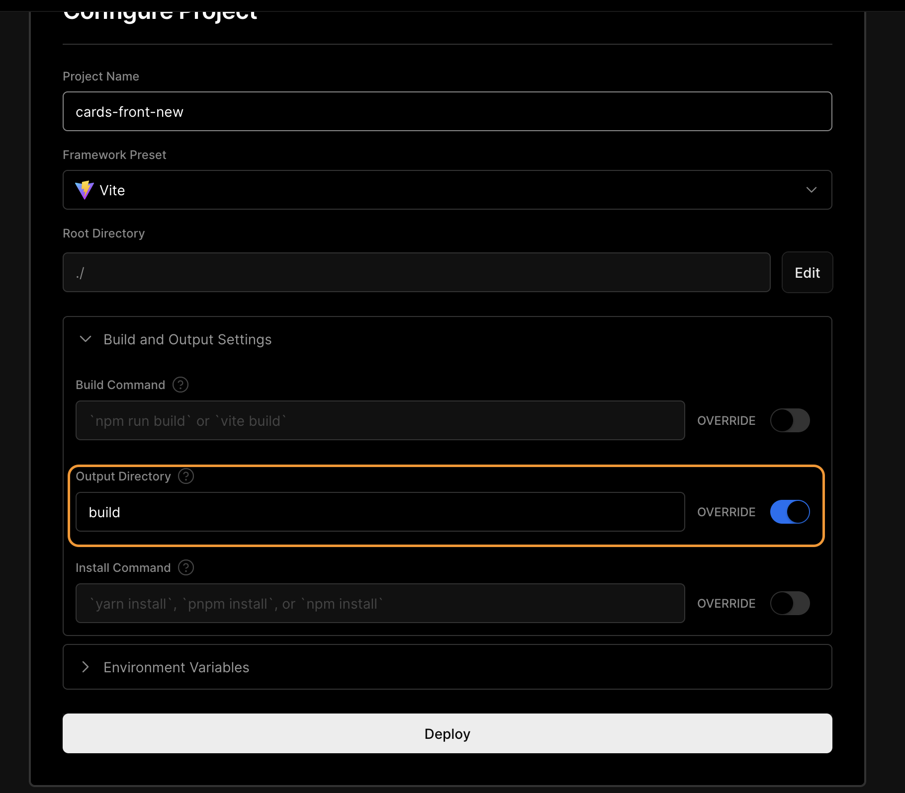

# Chapter 2

## Deploy to Vercel

You should already know how to do it.

If you're using the Redux-vite template make sure to change the output directory to 'build' in project settings on
Vercel:


Make sure it is deployed successfully.

## Storybook

- Install:

```bash
pnpm dlx storybook@latest init
```

> **Accept eslint config**

- Try it out:

```bash
pnpm run storybook
```

## Install fonts

[Fontsource/montserrat](https://fontsource.org/fonts/montserrat)

```bash
pnpm install @fontsource-variable/montserrat
```

```tsx
// main.tsx

import '@fontsource-variable/montserrat'
```

## Set up css variables

- Create an _src/styles_ directory in your project  
  containing the following files:

```markdown
src  
 └── styles  
 └── \_boilerplate.scss  
 └── \_colors.scss  
 └── \_typography.scss  
 └── index.scss
```

- Add the following to _index.scss_:

```scss
@forward 'colors';
@forward 'typography';
@forward 'boilerplate';
```

- Add the following to \__colors.scss_:

```scss
:root {
  // text
  --color-text-primary: #000;
  --color-text-secondary: #fff;

  // backgrounds
  --color-bg-primary: #3d3d3d;
  --color-bg-secondary: #fcfcfc;
  --color-bg-tertiary: #efefef;

  // palette
  --color-primary: #366eff;
  --color-secondary: #ffc700;
  --color-danger: #ff3636;
}
```

> Add any extra colors you need yourself

- Add the following to \__typography.scss_:

```scss
:root {
  --font-family-primary: 'Montserrat Variable', sans-serif;

  // line heights
  --line-height-xs: 0.991rem;
  --line-height-s: 1.219rem;
  --line-height-m: 1.5rem;
  --line-height-l: 1.75rem;
}
```

> Add font sizes and font weights yourself

> Transform font sizes to rem: <https://nekocalc.com/px-to-rem-converter>

- Add the following to \__boilerplate.scss_:

```scss
html {
  font-size: 100%;

  -webkit-font-smoothing: antialiased;
  -moz-osx-font-smoothing: grayscale;
}

*,
*::before,
*::after {
  box-sizing: border-box;
}

input,
button,
select,
textarea,
optgroup,
option {
  font-family: inherit;
  font-size: inherit;
  font-weight: inherit;
  font-style: inherit;
  color: inherit;
}

body {
  margin: 0;
  padding: 0;

  font-family: var(--font-family-primary);
  line-height: var(--line-height-m);
  color: var(--color-text-primary);

  background-color: var(--color-bg-primary);
}
```

- Import _index.scss_ in _main.tsx_:

```tsx
// main.tsx

import './styles/index.scss'
```

- Import fonts and styles in storybook:

```tsx
// .storybook/preview.tsx
import '@fontsource-variable/montserrat'
import '../src/styles/index.scss'
```

## Components

- Create an _src/components/ui_ directory in your project

### Button

- Create a _button_ directory in _src/components/ui_ with the following files:

```markdown
src  
 └── components  
 └── ui  
 └── button  
 └── button.tsx  
 └── button.module.scss  
 └── button.stories.ts
└── index.ts
```

> **Try to create the component yourself first**

Essentially, we are going to have 5 variants of our button:

- Primary (blue)
- Secondary (white)
- Danger (orange)
- Full width
- A link that looks like a button

What it means is that we are going to need these props:
<https://www.tints.dev>

```tsx
import { ComponentPropsWithoutRef } from 'react'

type ButtonProps = {
  variant?: 'primary' | 'secondary' | 'danger'
  fullWidth?: boolean
} & ComponentPropsWithoutRef<'button'>
```

The problem here is that we are getting button props, but we will also need it to be a link, and, potentially, a react-router-dom Link, so we want to make our component polymorphic:

```tsx

```
