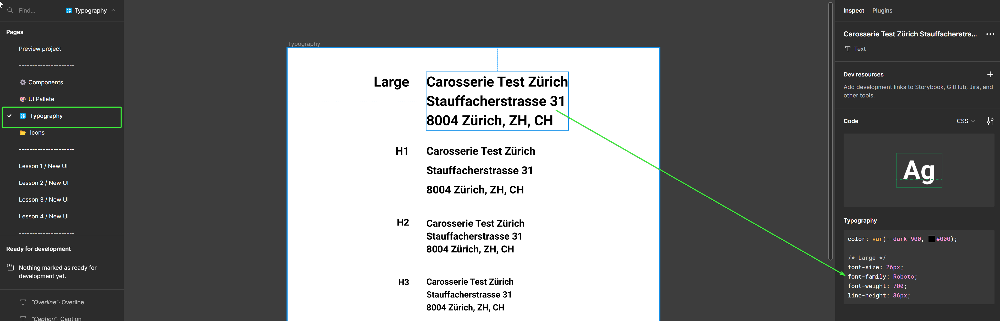
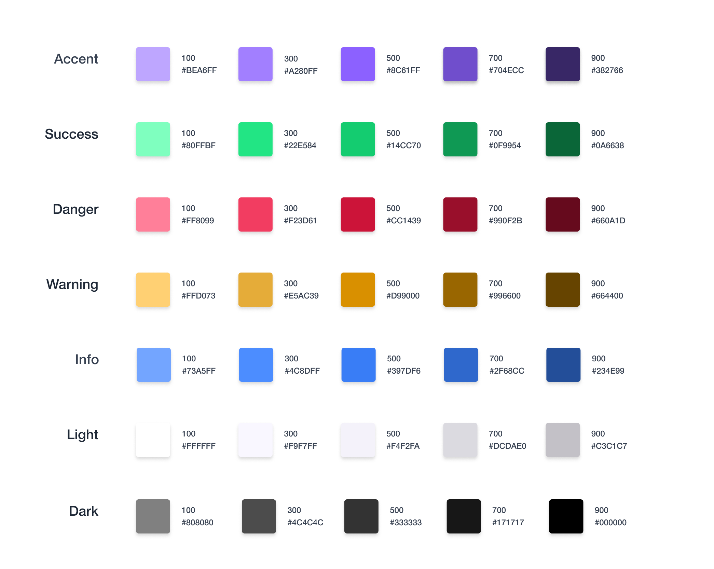

import { Callout } from 'nextra/components'

## Storybook

- Установим storybook:

```bash filename="Terminal"
pnpm dlx storybook@latest init
```

<Callout type="info">Соглашаемся на установку eslint конфига</Callout>

- Запускаем storybook:

```bash filename="Terminal"
pnpm run storybook
```

## Установка шрифтов

Что бы понять какие шрифты нам нужны, нужно посмотреть на дизайн, вкладка Typography:



Нам нужен шрифт Roboto, доступный на Fontsource:
[Fontsource/Roboto](https://fontsource.org/fonts/roboto)

- Установим шрифт:

```bash filename="Terminal"
pnpm install @fontsource/roboto
```

- Импортируем шрифт в _main.tsx_ и в _preview.ts_:

```tsx filename="main.tsx"
import '@fontsource/roboto/400.css'
import '@fontsource/roboto/700.css'
```

```tsx filename=".storybook/preview.ts"
import '@fontsource/roboto/400.css'
import '@fontsource/roboto/700.css'
```

<Callout type="info">
  В данном случае нам нужны только вариации 400 и 700, поэтому их и ставим. Помните, что если Вам
  понадобиться использовать другую толщину шрифта, его нужно будет также импортировать
</Callout>

## CSS переменные

- Создадим директорию _src/styles_ в проекте
  и добавим в нее следующие файлы:

{/* prettier-ignore */}
```markdown
src
└── styles
    └── _boilerplate.scss
    └── _colors.scss
    └── _typography.scss
    └── index.scss
```

- Добавим следующее в _index.scss_:

```scss filename="index.scss"
@forward 'colors';
@forward 'typography';
@forward 'boilerplate';
```

- Добавим цвета из дизайна в \__colors.scss_:



```scss filename="colors.scss"
:root {
  // accent
  --color-accent-100: #bea6ff;
  --color-accent-300: #a280ff;
  --color-accent-500: #8c61ff;
  --color-accent-700: #704ecc;
  --color-accent-900: #382766;

  // success
  --color-success-100: #80ffbf;
  --color-success-300: #22e584;
  --color-success-500: #14cc70;
  --color-success-700: #0f9954;
  --color-success-900: #0a6638;

  // danger
  --color-danger-100: #ff8099;
  --color-danger-300: #f23d61;
  --color-danger-500: #cc1439;
  --color-danger-700: #990f2b;
  --color-danger-900: #660a1d;

  // warning
  --color-warning-100: #ffd073;
  --color-warning-300: #e5ac39;
  --color-warning-500: #d99000;
  --color-warning-700: #960;
  --color-warning-900: #640;

  // info
  --color-info-100: #73a5ff;
  --color-info-300: #4c8dff;
  --color-info-500: #397df6;
  --color-info-700: #2f68cc;
  --color-info-900: #234e99;

  // light
  --color-light-100: #fff;
  --color-light-300: #f9f7ff;
  --color-light-500: #f4f2fa;
  --color-light-700: #dcdae0;
  --color-light-900: #c3c1c7;

  // dark
  --color-dark-100: #808080;
  --color-dark-300: #4c4c4c;
  --color-dark-500: #333;
  --color-dark-700: #171717;
  --color-dark-900: #000;
}
```

- Добавим переменные для типографии в \__typography.scss_:

```scss filename="_typography.scss"
:root {
  --font-family-primary: 'Roboto', sans-serif;

  // line heights
  --line-height-s: 16px;
  --line-height-m: 24px;
  --line-height-l: 36px;

  // font sizes
  --font-size-xs: 0.75rem;
  --font-size-s: 0.875rem;
  --font-size-m: 1rem;
  --font-size-l: 1.125rem;
  --font-size-xl: 1.25rem;
  --font-size-xxl: 1.625rem;

  // font weights
  --font-weight-regular: 400;
  --font-weight-bold: 700;
}
```

- Добавим обнуление стандартных стилей и некоторые стандартные значения в \__boilerplate.scss_:

```scss filename="_boilerplate.scss"
html {
  box-sizing: border-box;
  font-size: 100%;

  -webkit-font-smoothing: antialiased;
  -moz-osx-font-smoothing: grayscale;
}

*,
*::before,
*::after {
  box-sizing: border-box;
}

input,
button,
select,
textarea,
optgroup,
option {
  font-family: inherit;
  font-size: inherit;
  font-weight: inherit;
  font-style: inherit;
  color: inherit;
}

a:visited {
  color: inherit;
}

body {
  margin: 0;
  padding: 0;

  font-family: var(--font-family-primary), sans-serif;
  line-height: var(--line-height-m);
  color: var(--color-light-100);

  background-color: var(--color-dark-900);
}
```

- Импортируем _index.scss_ в _main.tsx_ и _preview.ts_:

```tsx filename="main.tsx"
import './styles/index.scss'
```

```tsx filename="preview.ts"
import '../src/styles/index.scss'
```

<Callout type={'warning'}>
  Не забудьте удалить <i>index.css</i> если не сделали этого ранее
</Callout>

## Запустим Storybook и проект и проверим

- Запустите Storybook:

```bash filename="Terminal"
pnpm storybook
```

- Убедитесь, что все работает и стили применяются

- Запустите проект:

```bash filename="Terminal"
pnpm dev
```

- Убедитесь, что все работает и стили применяются

## Коммитим изменения

```bash filename="Terminal"
git add .
git commit -m "feat: add styles"
```
