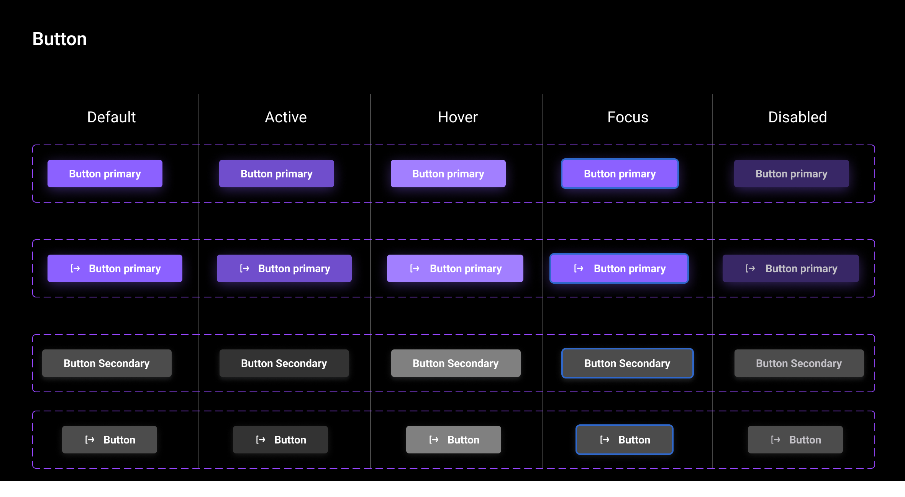
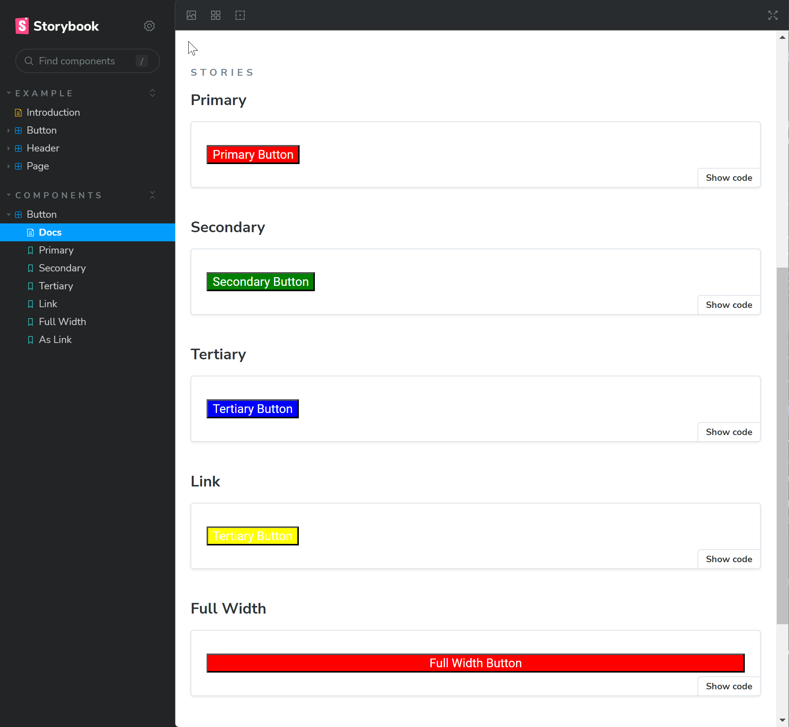
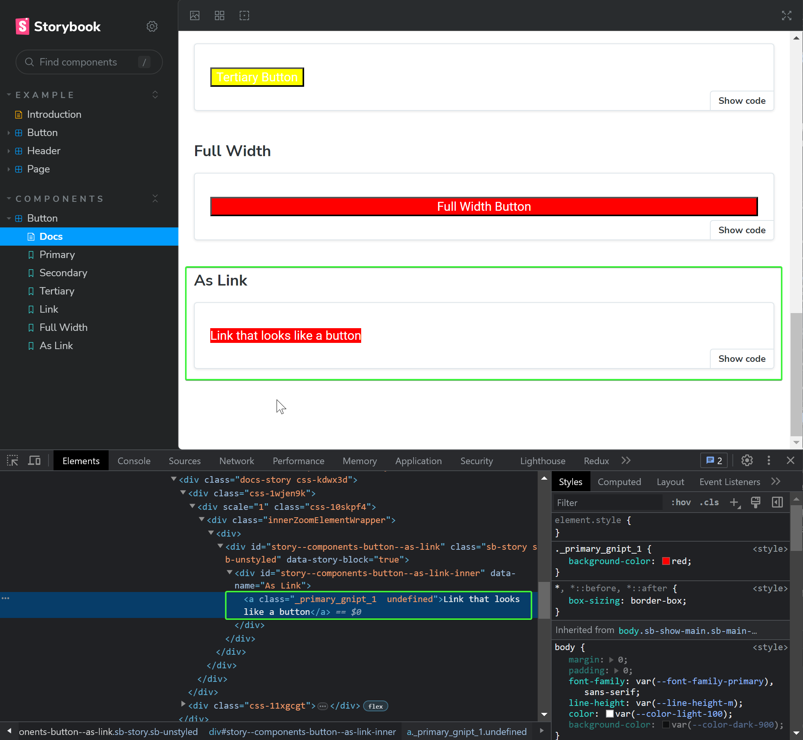
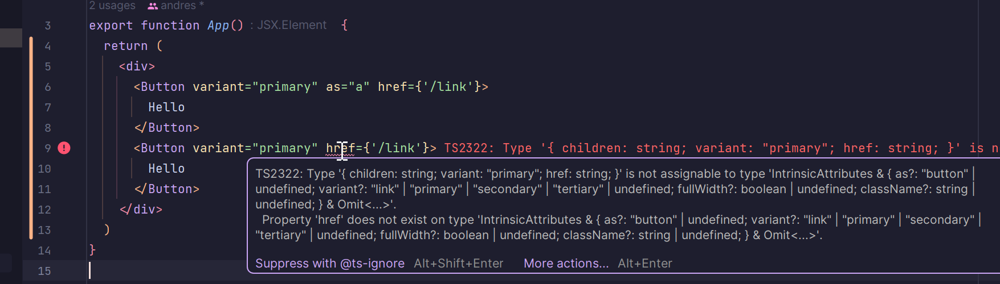

import { Callout } from 'nextra/components'

# Компоненты, полиморфные компоненты

## Button

### Подготовка

- Создайте папку _src/components/ui_

- Создайте папку _button_ в _src/components/ui_ со следующей структурой:

{/* prettier-ignore */}
```markdown
src
└── components
    └── ui
        └── button
            └── button.tsx
            └── button.module.scss
            └── button.stories.ts
            └── index.ts
```

### Дизайн и варианты

После рассмотрения дизайна стало понятно, что у нас будет несколько вариантов кнопок, а именно:



- Стандартная, она же основная, она же `primary`
- Второстепенная, она же `secondary`
- Третьестепенная, она же `tertiary`, иногда ее называют `outlined`
- Кнопка, занимающая всю ширину родителя, она же `fullWidth`
- Кнопка, которая выглядит как ссылка, она же `link`
- Ссылка, которая выглядит как кнопка

### Варианты реализации

Какие варианты реализации у нас есть?

1. Создать один компонент, который будет принимать все возможные пропсы и в зависимости от них будет рендериться тот или иной вариант кнопки
2. Создать отдельный компонент для каждого варианта кнопки

Мы отдадим предпочтение **первому варианту**, так как он более гибкий и позволит нам легко добавлять новые варианты кнопок в будущем.

### Props

Опишем пропсы, которые будет принимать наш компонент:

```tsx filename="button.tsx"
import { ComponentPropsWithoutRef } from 'react'

export type ButtonProps = {
  variant?: 'primary' | 'secondary' | 'tertiary' | 'link'
  fullWidth?: boolean
} & ComponentPropsWithoutRef<'button'>
```

`ComponentPropsWithoutRef<'button'>` - это пропсы, которые принимает стандартный html-тег button, мы их расширяем своими пропсами.

### Реализация

Создадим сам компонент:

```tsx
import s from './button.module.scss'

export const Button = ({ variant = 'primary', fullWidth, className, ...rest }: ButtonProps) => {
  return (
    <button className={`${s[variant]} ${fullWidth ? s.fullWidth : ''} ${className}`} {...rest} />
  )
}
```

Для проверки добавим стили в _button.module.scss_:

```scss filename="button.module.scss"
.primary {
  background-color: red;
}

.secondary {
  background-color: green;
}

.tertiary {
  background-color: blue;
}

.link {
  background-color: yellow;
}

.fullWidth {
  width: 100%;
}
```

<Callout type="info">Стили согласно дизайну напишите сами</Callout>

- В файл _index.ts_ добавим экспорт компонента:

```ts filename="src/components/ui/button/index.ts"
export * from './button'
```

- Добавим stories для компонента:

```tsx filename="button.stories.ts"
import type { Meta, StoryObj } from '@storybook/react'

import { Button } from './'

const meta = {
  title: 'Components/Button',
  component: Button,
  tags: ['autodocs'],
  argTypes: {
    variant: {
      options: ['primary', 'secondary', 'tertiary', 'link'],
      control: { type: 'radio' },
    },
  },
} satisfies Meta<typeof Button>

export default meta
type Story = StoryObj<typeof meta>

export const Primary: Story = {
  args: {
    variant: 'primary',
    children: 'Primary Button',
    disabled: false,
  },
}

export const Secondary: Story = {
  args: {
    variant: 'secondary',
    children: 'Secondary Button',
    disabled: false,
  },
}
export const Tertiary: Story = {
  args: {
    variant: 'tertiary',
    children: 'Tertiary Button',
    disabled: false,
  },
}
export const Link: Story = {
  args: {
    variant: 'link',
    children: 'Tertiary Button',
    disabled: false,
  },
}

export const FullWidth: Story = {
  args: {
    variant: 'primary',
    children: 'Full Width Button',
    disabled: false,
    fullWidth: true,
  },
}
```

Вот что должно получиться:



## Полиморфные компоненты

### Теория и реализация

Дизайнеры могут внезапно решить, что кнопка должна выглядеть как ссылка, а ссылка как кнопка,
но при этом мы должны рендерить правильные тэги в DOM, для удобства пользователей. Как быть в таком случае?
Для этого нам нужно будет передать нужный тег через пропс:

```tsx filename="button.tsx" showLineNumbers {6,15,19} /Component/4
import { ComponentPropsWithoutRef } from 'react'

import s from './button.module.scss'

export type ButtonProps = {
  as: any
  variant?: 'primary' | 'secondary' | 'tertiary' | 'link'
  fullWidth?: boolean
} & ComponentPropsWithoutRef<'button'>

export const Button = ({
  variant = 'primary',
  fullWidth,
  className,
  as: Component = 'button',
  ...rest
}: ButtonProps) => {
  return (
    <Component className={`${s[variant]} ${fullWidth ? s.fullWidth : ''} ${className}`} {...rest} />
  )
}
```

Этот

Добавим в stories пример использования:

```tsx filename="button.stories.ts"
export const AsLink: Story = {
  args: {
    variant: 'primary',
    children: 'Link that looks like a button',
    as: 'a',
  },
}
```

И проверим что всё работает как надо:



Как видите, в DOM мы получили тег `a` с нужными пропсами.

<Callout>
  В данном примере кнопка с тэгом 'a' не выглядит так, как обычная кнопка. Это связано со
  стандартными стилями браузера и будет работать как надо когда мы застилизуем нашу кнопку правильно
</Callout>

### Типизация

В примере выше мы использовали `as: any`, но это не очень хорошо, так как мы теряем типизацию. Давайте попробуем это исправить.

Добавим generic параметр в наш компонент и в пропсы:

```tsx filename="button.tsx" showLineNumbers {1,5,6,7,11,13,14}
import { ComponentPropsWithoutRef, ElementType, ReactNode } from 'react'

import s from './button.module.scss'

export type ButtonProps<T extends ElementType = 'button'> = {
  as?: T
  children: ReactNode
  variant?: 'primary' | 'secondary' | 'tertiary' | 'link'
  fullWidth?: boolean
  className?: string
} & ComponentPropsWithoutRef<T>

export const Button = <T extends ElementType = 'button'>(props: ButtonProps<T>) => {
  const { variant = 'primary', fullWidth, className, as: Component = 'button', ...rest } = props

  return (
    <Component className={`${s[variant]} ${fullWidth ? s.fullWidth : ''} ${className}`} {...rest} />
  )
}
```

Попробуем отрисовать две кнопки в App.tsx, где одна кнопка будет с тегом `button`, а другая с тегом `a`:



Типизация работает правильно, потому что в первом случае мы отрисовываем тэг `a`, у которого есть проп `href`, а во втором случае мы отрисовываем тэг `button`, у которого его нет, поэтому мы и видим ошибку.

<Callout type={'default'}>
  Обратите внимание, что типизацию мы тестировали в App.tsx, а не в stories, потому что storybook
  все еще иногда ошибается с TypeScript.
</Callout>

Все работает как надо, но нужно поправить еще один маленький нюанс:
Из-за того, что мы заранее не знаем какие пропсы будут у компонента, мы указали className как параметр нашей кнопки (расширяя стандартные пропсы), чтобы не потерять его типизацию:

```tsx filename="button.tsx" showLineNumbers {9}
import { ComponentPropsWithoutRef, ElementType } from 'react'

import s from './button.module.scss'

export type ButtonProps<T extends ElementType = 'button'> = {
  as?: T
  variant?: 'primary' | 'secondary' | 'tertiary' | 'link'
  fullWidth?: boolean
  className?: string
} & ComponentPropsWithoutRef<T>

export const Button = <T extends ElementType = 'button'>(props: ButtonProps<T>) => {
  const { variant = 'primary', fullWidth, className, as: Component = 'button', ...rest } = props

  return (
    <Component className={`${s[variant]} ${fullWidth ? s.fullWidth : ''} ${className}`} {...rest} />
  )
}
```

Это может привести к неожиданным коллизиям и странным ошибкам TypeScript'а, поэтому мы добавим небольшую проверку:

```tsx filename="button.tsx" showLineNumbers {13}
import { ComponentPropsWithoutRef, ElementType } from 'react'

import s from './button.module.scss'

export type ButtonProps<T extends ElementType = 'button'> = {
  as?: T
  variant?: 'primary' | 'secondary' | 'tertiary' | 'link'
  fullWidth?: boolean
  className?: string
} & ComponentPropsWithoutRef<T>

export const Button = <T extends ElementType = 'button'>(
  props: ButtonProps<T> & Omit<ComponentPropsWithoutRef<T>, keyof ButtonProps<T>>
) => {
  const { variant = 'primary', fullWidth, className, as: Component = 'button', ...rest } = props

  return (
    <Component className={`${s[variant]} ${fullWidth ? s.fullWidth : ''} ${className}`} {...rest} />
  )
}
```

С помощью Omit мы убираем из пропсов переданного компонента все пропсы, которые уже есть в наших кастомных пропсах, тем самым избегая коллизий.

Подробнее про типизацию полиморфных компонентов можно почитать [вот тут](https://itnext.io/react-polymorphic-components-with-typescript-f7ce72ea7af2).

### Коммитим изменения

```bash filename="Terminal"
git add . && git commit -m "add polymorphic button"
```
