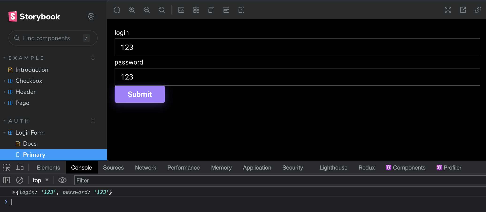
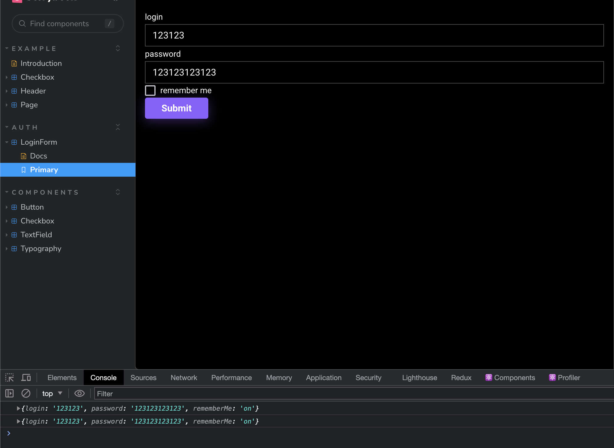

# Формы

## React-hook-form

[React-hook-form](https://react-hook-form.com/) - это библиотека для управляемых форм в React. Она позволяет управлять состоянием формы и валидацией внутри формы. В отличие от других библиотек, таких как Formik, React-hook-form не использует контекст, а вместо этого полагается на нативные возможности React, такие как управляемые компоненты и хуки.

### Установка

```bash
pnpm i react-hook-form
```

### Использование

```tsx filename="src/components/auth/login-form/login-form.tsx"
import { useForm } from 'react-hook-form'

import { Button } from '../../ui/button'
import { TextField } from '../../ui/text-field'

type FormValues = {
  login: string
  password: string
}

export const LoginForm = () => {
  const { register, handleSubmit } = useForm<FormValues>()

  const onSubmit = (data: FormValues) => {
    console.log(data)
  }

  return (
    <form onSubmit={handleSubmit(onSubmit)}>
      <TextField {...register('login')} label={'login'} />
      <TextField {...register('password')} label={'password'} />
      <Button type="submit">Submit</Button>
    </form>
  )
}
```

```tsx filename="src/components/auth/login-form/login-form.stories.tsx"
import type { Meta, StoryObj } from '@storybook/react'

import { LoginForm } from './login-form'

const meta = {
  title: 'Auth/LoginForm',
  component: LoginForm,
  tags: ['autodocs'],
} satisfies Meta<typeof LoginForm>

export default meta
type Story = StoryObj<typeof meta>

export const Primary: Story = {}
```

Проверим:


Все работает как надо на данном этапе, но не хватает чекбокса rememberMe. Добавим его:

```tsx filename="login-form.tsx" showLineNumbers {4,11}
type FormValues = {
  login: string
  password: string
  rememberMe: boolean
}
...
  return (
    <form onSubmit={handleSubmit(onSubmit)}>
      <TextField {...register('login')} label={'login'} />
      <TextField {...register('password')} label={'password'} />
      <Checkbox {...register('rememberMe')} label={'remember me'} />
      <Button type="submit">Submit</Button>
    </form>
  )
...
```

Проверяем и получаем вот такой результат:


Совсем нет то что мы ожидали. Это происходит из-за того что чекбокс из radix ui не совместим напрямую с register().
Что бы это исправить, воспользуемся хуком useController из react-hook-form:

```tsx filename="login-form.tsx" showLineNumbers {1,14,20-26,32}
import { useController, useForm } from 'react-hook-form'

import { Checkbox } from '../../ui/checkbox'
import { TextField } from '../../ui/text-field'
import { Button } from '../../ui/button'

type FormValues = {
  login: string
  password: string
  rememberMe: boolean
}

export const LoginForm = () => {
  const { control, handleSubmit, register } = useForm<FormValues>()

  const onSubmit = (data: FormValues) => {
    console.log(data)
  }

  const {
    field: { value, onChange },
  } = useController({
    name: 'rememberMe',
    control,
    defaultValue: false,
  })

  return (
    <form onSubmit={handleSubmit(onSubmit)}>
      <TextField {...register('login')} label={'login'} />
      <TextField {...register('password')} label={'password'} />
      <Checkbox onCheckedChange={onChange} checked={value} label={'remember me'} />
      <Button type="submit">Submit</Button>
    </form>
  )
}
```

Теперь все должно работать как надо!
