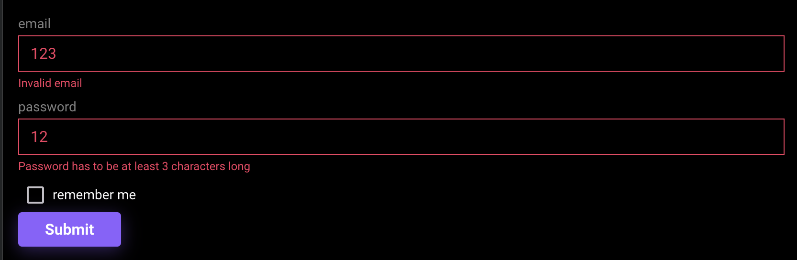

import { Callout } from 'nextra/components'

## Нативная валидация через react-hook-form

React-hook-form поддерживает валидации [из коробки](https://react-hook-form.com/get-started#Applyvalidation)

Давайте провалидируем нашу форму:

- Email должен быть обязательным полем и валидным email адресом
- Пароль должен быть обязательным полем и иметь минимум 3 символа

```tsx filename="src/components/auth/login-form/login-form.stories.tsx" {3,4,5,6,10,11,12,13} showLineNumbers
<form onSubmit={handleSubmit(onSubmit)}>
  <TextField
    {...register('email', {
      required: 'Email is required',
      pattern: { value: emailRegex, message: 'Invalid email' },
    })}
    label={'email'}
  />
  <TextField
    {...register('password', {
      required: 'Password is required',
      minLength: { value: 3, message: 'Password has to be at least 3 characters long' },
    })}
    label={'password'}
  />
  <Checkbox onChange={onChange} checked={value} label={'remember me'} />
  <Button type="submit">Submit</Button>
</form>
...

const emailRegex =
  /^([\w-]+(?:\.[\w-]+)*)@((?:[\w-]+\.)*\w[\w-]{0,66})\.([a-z]{2,6}(?:\.[a-z]{2})?)$/
```

Добавим логирование ошибок что бы проверить что валидация работает правильно:

```tsx filename="src/components/auth/login-form/login-form.stories.tsx" {5,8} showLineNumbers
const {
  control,
  register,
  handleSubmit,
  formState: { errors },
} = useForm<FormValues>()

console.log('errors: ', errors)
```

Получим следующий результат:


Теперь покажем эти ошибки пользователю:

```tsx filename="src/components/auth/login-form/login-form.tsx" {8,16} showLineNumbers
<form onSubmit={handleSubmit(onSubmit)}>
  <TextField
    {...register('email', {
      required: 'Email is required',
      pattern: { value: emailRegex, message: 'Invalid email' },
    })}
    label={'email'}
    errorMessage={errors.email?.message}
  />
  <TextField
    {...register('password', {
      required: 'Password is required',
      minLength: { value: 3, message: 'Password has to be at least 3 characters long' },
    })}
    label={'password'}
    errorMessage={errors.password?.message}
  />
  <Checkbox onChange={onChange} checked={value} label={'remember me'} />
  <Button type="submit">Submit</Button>
</form>
```

Получаем следующий результат:


## Валидация с помощью библиотек

Такое решение отлично подходит для форм с несложными валидациями и небольшим количеством полей. Но если у нас будет форма с 10 полями и сложными валидациями, то код будет нечитаемым и сложным для поддержки.

Для таких случаев есть библиотеки, которые помогают упростить валидацию форм.

- [Zod](https://zod.dev)
- [Joi](https://github.com/hapijs/joi)
- [Yup](https://github.com/jquense/yup)

Все они поддерживаются react-hook-form с помощью [@hookform/resolvers](https://www.npmjs.com/package/@hookform/resolvers)

Все они действуют по одному принципу, но лично мне больше всего нравится Zod, поэтому его и будем использовать.

### Zod

Установим Zod и @hookform/resolvers

```bash filename="Terminal"
pnpm i zod @hookform/resolvers
```

Создадим валидационную схему:

```tsx filename="src/components/auth/login-form/login-form.tsx" showLineNumbers
import { z } from 'zod'

const loginSchema = z.object({
  email: z.string().email(),
  password: z.string().min(3),
})
```

Используем ее в useForm:

```tsx filename="src/components/auth/login-form/login-form.tsx" showLineNumbers {1,8,9,10}
import { zodResolver } from '@hookform/resolvers/zod'

const {
  control,
  register,
  handleSubmit,
  formState: { errors },
} = useForm<FormValues>({
  resolver: zodResolver(loginSchema),
})
```

Удалим валидацию из TextField:

```tsx filename="src/components/auth/login-form/login-form.tsx" {2,3} showLineNumbers
<form onSubmit={handleSubmit(onSubmit)}>
  <TextField {...register('email')} label={'email'} errorMessage={errors.email?.message} />
  <TextField {...register('password')} label={'password'} errorMessage={errors.password?.message} />
  <Checkbox onChange={onChange} checked={value} label={'remember me'} />
  <Button type="submit">Submit</Button>
</form>
```

Получим следующий результат:


Сообщения об ошибках создались автоматически, но мы можем и поменять их на свои, подробнее можно узнать в [документации](https://zod.dev/?id=strings)

### Автогенерация типов для форм

Для того что бы не писать типы для формы вручную, можно воспользоваться `z.infer`:

```tsx filename="src/components/auth/login-form/login-form.tsx" {4,7} showLineNumbers
const loginSchema = z.object({
  email: z.string().email(),
  password: z.string().min(3),
  rememberMe: z.boolean().default(false),
})

type FormValues = z.infer<typeof loginSchema>
```

Огромный плюс валидационных схем в связке с react-hook-form в том, что мы разделяем ui (jsx) и
бизнес логику (валидация). Таким образом мы можем использовать одну и ту же валидационную схему для разных форм.

<Callout>
  Хорошей практикой считается выносить схемы и типы в отдельные файлы, сделайте это сами.
</Callout>
