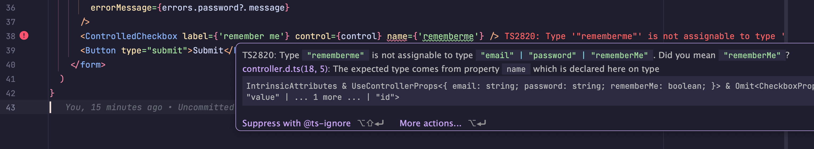
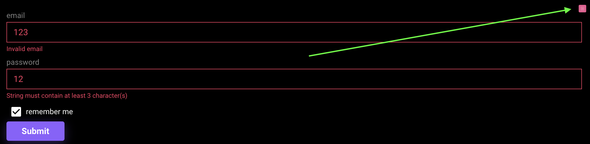
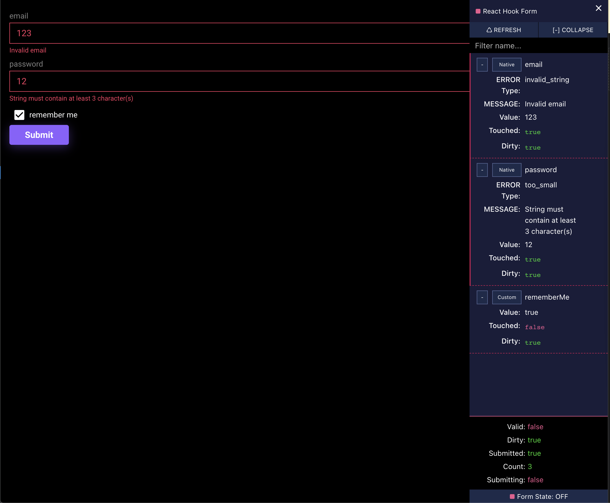

import { Callout } from 'nextra/components'

# Рефакторинг

Проблема:

- Компонент LoginForm стал слишком сложным, в нем много логики завязанной на формах, и всему виной useController.

Решение:

- Создать автономные компоненты `ControlledCheckbox` и `ControlledTextField` и использовать их в `LoginForm`

## ControlledCheckbox

### Минимально рабочая реализация

Создадим файл `controlled-checkbox.tsx` и вынесем туда логику `useController` и `Checkbox`:

```tsx filename="src/components/ui/controlled/controlled-checkbox/controlled-checkbox.tsx"
import { useController, UseControllerProps } from 'react-hook-form'

import { Checkbox, CheckboxProps } from '@/components'

export type ControlledCheckboxProps = UseControllerProps<any> &
  Omit<CheckboxProps, 'onChange' | 'value' | 'id'>

export const ControlledCheckbox = ({
  name,
  rules,
  shouldUnregister,
  control,
  defaultValue,
  ...checkboxProps
}: ControlledCheckboxProps) => {
  const {
    field: { onChange, value },
  } = useController({
    name,
    rules,
    shouldUnregister,
    control,
    defaultValue,
  })

  return (
    <Checkbox
      {...{
        onChange,
        checked: value,
        id: name,
        ...checkboxProps,
      }}
    />
  )
}
```

<Callout>В UseControllerProps пока что передадим any</Callout>

Уберем из `LoginForm` логику `useController` и заменим на `ControlledCheckbox`:

```tsx filename="src/components/auth/login-form/login-form.tsx" showLineNumbers {12}
import { ControlledCheckbox } from '@/components'

// ...
return (
  <form onSubmit={handleSubmit(onSubmit)}>
    <TextField {...register('email')} label={'email'} errorMessage={errors.email?.message} />
    <TextField
      {...register('password')}
      label={'password'}
      errorMessage={errors.password?.message}
    />
    <ControlledCheckbox label={'remember me'} control={control} name={'rememberMe'} />
    <Button type="submit">Submit</Button>
  </form>
)
```

Проп `name` отвечает за название поля в форме, а `control` за то, какой контроллер будет использоваться.

<Callout>Убедитесь что все работает как надо</Callout>

### Типизация

Проблема:

Сейчас в качестве control и name можно передать что угодно, а это может привести к ошибкам которые тяжело дебажить.

Теперь давайте типизируем `ControlledCheckboxProps`, для этого воспользуемся дженериками:

```tsx filename="src/components/ui/controlled/controlled-checkbox/controlled-checkbox.tsx" showLineNumbers {1,5,6,8,15}
import { FieldValues, useController, UseControllerProps } from 'react-hook-form'

import { Checkbox, CheckboxProps } from '@/components'

export type ControlledCheckboxProps<TFieldValues extends FieldValues> =
  UseControllerProps<TFieldValues> & Omit<CheckboxProps, 'onChange' | 'value' | 'id'>

export const ControlledCheckbox = <TFieldValues extends FieldValues>({
  name,
  rules,
  shouldUnregister,
  control,
  defaultValue,
  ...checkboxProps
}: ControlledCheckboxProps<TFieldValues>) => {
  // ...
}
```

Попробуем допустить ошибку в `name`:



Все работает как и ожидалось :)

## React-hook-form devtools

Проблема:

- Дебажить через консоль неудобно, хочется видеть что происходит в форме в реальном времени.

Решение:

- Использовать [react-hook-form devtools](https://www.react-hook-form.com/dev-tools/)

### Установка

Установим devtools:

```bash filename="Terminal"
pnpm i -D @hookform/devtools
```

### Использование

И добавим их в `LoginForm`:

```tsx filename="src/components/auth/login-form/login-form.tsx" showLineNumbers {1,7}
import { DevTool } from '@hookform/devtools'

// ...

return (
  <form onSubmit={handleSubmit(onSubmit)}>
    <DevTool control={control} />
    <TextField {...register('email')} label={'email'} errorMessage={errors.email?.message} />
    <TextField
      {...register('password')}
      label={'password'}
      errorMessage={errors.password?.message}
    />
    <ControlledCheckbox label={'remember me'} control={control} name={'rememberMe'} />
    <Button type="submit">Submit</Button>
  </form>
)
```

### Скриншоты

Теперь у нас появилась кнопка, при нажатии на которую открывается панель с информацией о форме:





<Callout type={'info'}>
  Эта панель будет доступна только в разработке, в опубликованном проекте кнопки не будет.
</Callout>
