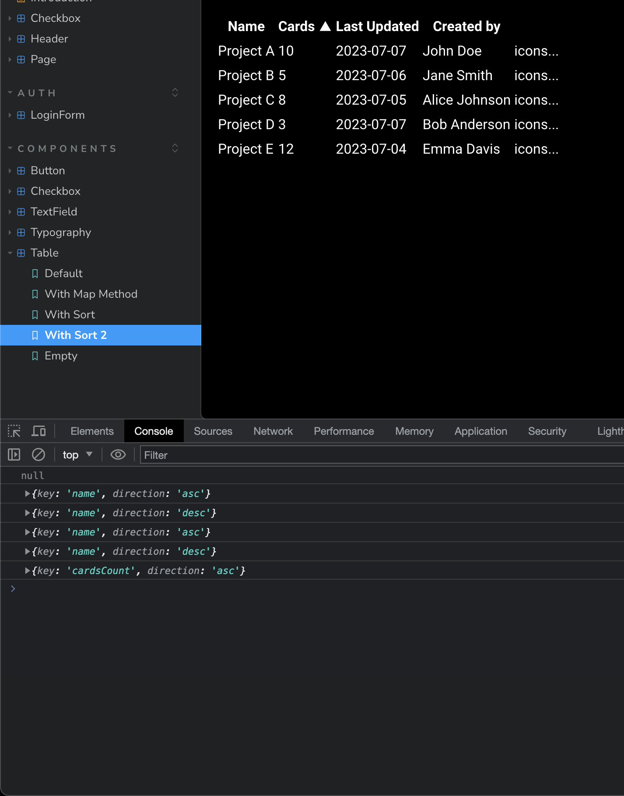

# Таблицы

## Сортировка

Наш бэкэнд будет принимать параметр sort формата `name-asc` где `name` -
название поля, а `asc` - направление сортировки. Возможные направления сортировки:
`asc` и `desc`.

Добавим возможность сортировки для таблиц, для этого:

- Создадим историю в сторибуке:

```tsx
const data = [
  {
    title: 'Project A',
    cardsCount: 10,
    updated: '2023-07-07',
    createdBy: 'John Doe',
  },
  {
    title: 'Project B',
    cardsCount: 5,
    updated: '2023-07-06',
    createdBy: 'Jane Smith',
  },
  {
    title: 'Project C',
    cardsCount: 8,
    updated: '2023-07-05',
    createdBy: 'Alice Johnson',
  },
  {
    title: 'Project D',
    cardsCount: 3,
    updated: '2023-07-07',
    createdBy: 'Bob Anderson',
  },
  {
    title: 'Project E',
    cardsCount: 12,
    updated: '2023-07-04',
    createdBy: 'Emma Davis',
  },
]
export const WithSort = {
  render: () => {
    return (
      <table>
        <thead>
          <tr>
            <th>Name</th>
            <th>Cards</th>
            <th>Last Updated</th>
            <th>Created by</th>
            <th></th>
          </tr>
        </thead>
        <tbody>
          {data.map(item => (
            <tr key={item.title}>
              <td>{item.title}</td>
              <td>{item.cardsCount}</td>
              <td>{item.updated}</td>
              <td>{item.createdBy}</td>
              <td>icons...</td>
            </tr>
          ))}
        </tbody>
      </table>
    )
  },
}
```

Получим просто таблицу, которая пока не сортируемая.

- Создадим стейт для сортировки:

```tsx
type Sort = {
  key: string
  direction: 'asc' | 'desc'
} | null

const [sort, setSort] = useState<Sort>(null)
```

- Добавим обработчик клика на заголовок таблицы:

```tsx
const handleSort = (key: string) => {
  if (sort && sort.key === key) {
    setSort({
      key,
      direction: sort.direction === 'asc' ? 'desc' : 'asc',
    })
  } else {
    setSort({
      key,
      direction: 'asc',
    })
  }
}
```

и используем его в таблице:

```tsx
<tr>
  <th onClick={() => handleSort('name')}>Name</th>
  <th onClick={() => handleSort('cardsCount')}>Cards</th>
  <th onClick={() => handleSort('updated')}>Last Updated</th>
  <th onClick={() => handleSort('createdBy')}>Created by</th>
  <th></th>
</tr>
```

- Добавим иконки в ячейки заголовка:

```tsx
<th onClick={() => handleSort('name')}>
  Name
  {sort && sort.key === 'name' && <span>{sort.direction === 'asc' ? '▲' : '▼'}</span>}
</th>
```

- Добавим `console.log()` для проверки стейта:

```tsx
console.log(sort)
```

Проверяем, при клике должна меняться иконка и в консоли должен появляться правильный объект.



## Рефакторинг

Мы повторяем слишком много кода в обработчиках, из-за чего мы оставляем слишком много шансов для ошибок.

Одним из возможных решений в данной ситуации будет создание массива с заголовками таблицы и использование его для отрисовки заголовков и обработчиков:

```tsx
const columns = [
  {
    key: 'name',
    title: 'Name',
  },
  {
    key: 'cardsCount',
    title: 'Cards',
  },
  {
    key: 'updated',
    title: 'Last Updated',
  },
  {
    key: 'createdBy',
    title: 'Created by',
  },
]

// ...

{
  columns.map(column => (
    <th key={column.key} onClick={() => handleSort(column.key)}>
      {column.title}
      {sort && sort.key === column.key && <span>{sort.direction === 'asc' ? '▲' : '▼'}</span>}
    </th>
  ))
}

// ...
```

Протипизируем columns:

```tsx
type Column = {
  key: string
  title: string
}
const columns: Array<Column> = ...
```

У нас будет несколько таблиц, поэтому имеет смысл вынести часть логики в отдельный компонент:

```tsx
export const Header: FC<
  Omit<
    ComponentPropsWithoutRef<thead> & {
      columns: Column[]
      sort?: Sort
      onSort?: (sort: Sort) => void
    },
    'children'
  >
> = ({ columns, sort, onSort, ...restProps }) => {
  const handleSort = (key: string, sortable?: boolean) => () => {
    if (!onSort || !sortable) return

    if (sort?.key !== key) return onSort({ key, direction: 'asc' })

    if (sort.direction === 'desc') return onSort(null)

    return onSort({
      key,
      direction: sort?.direction === 'asc' ? 'desc' : 'asc',
    })
  }

  return (
    <thead {...restProps}>
      <tr>
        {columns.map(({ title, key, sortable }) => (
          <th key={key} onClick={handleSort(key, sortable)}>
            {title}
            {sort && sort.key === key && <span>{sort.direction === 'asc' ? '▲' : '▼'}</span>}
          </th>
        ))}
      </tr>
    </thead>
  )
}
```

Обратите внимание, что состоянием мы будем управлять снаружи, а не внутри компонента.

Используем новый компонент:

```tsx
<table>
  <Header columns={columns} sort={sort} onSort={setSort} />
  {/*...*/}
</table>
```

И, наконец, создадим нужную нам строку для бэкэнда:

```tsx
const sortedString = useMemo(() => {
  if (!sort) return null

  return `${sort.key}-${sort.direction}`
}, [sort])

console.log(sortedString)
```

## Самостоятельная работа:

- Добавить сортировку по умолчанию (при третьем клике по заголовку таблицы сортировка должна сбрасываться (null))
