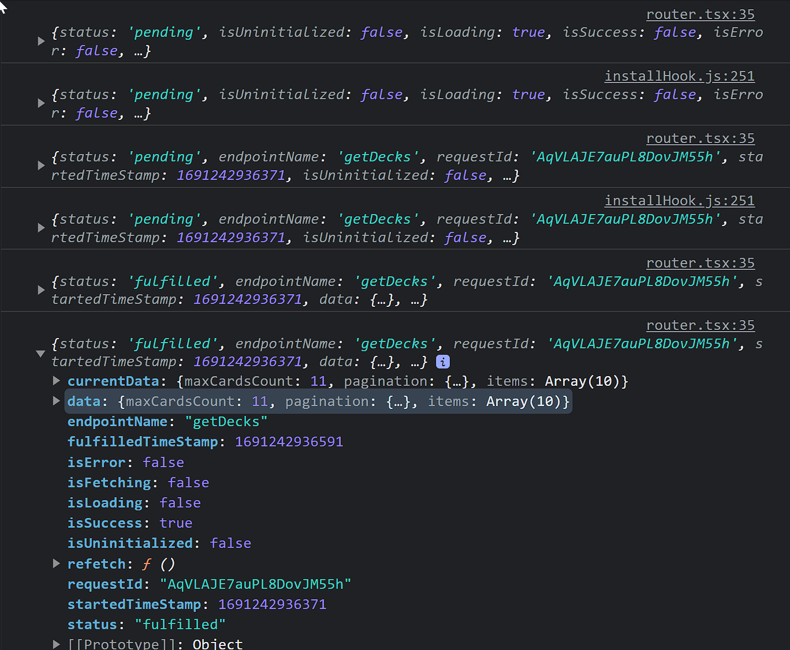

# RTK Query

## Установка

```bash filename="Terminal"
pnpm i @reduxjs/toolkit react-redux
```

## Создание стора

```ts filename="src/services/store.ts"
import { configureStore } from '@reduxjs/toolkit'

export const store = configureStore({
  reducer: {},
  middleware: getDefaultMiddleware => getDefaultMiddleware(),
})

export type AppDispatch = typeof store.dispatch
export type RootState = ReturnType<typeof store.getState>
```

## Подключение стора к приложению

```tsx filename="src/App.tsx"
import { Provider } from 'react-redux'

import { Router } from '@/router'
import { store } from '@/services/store'

export function App() {
  return (
    <Provider store={store}>
      <Router />
    </Provider>
  )
}
```

## Создание Api

### Создание базового Api

```ts filename="src/services/base-api.ts"
import { createApi, fetchBaseQuery } from '@reduxjs/toolkit/query/react'

export const baseApi = createApi({
  reducerPath: 'baseApi',
  baseQuery: fetchBaseQuery({
    baseUrl: 'https://api.flashcards.andrii.es',
    credentials: 'include',
    prepareHeaders: headers => {
      headers.append('x-auth-skip', 'true')
    },
  }),
  endpoints: builder => {
    return {
      getDecks: builder.query<any, void>({
        query: () => `v1/decks`,
      }),
    }
  },
})

export const { useGetDecksQuery } = baseApi
```

### Подключение базового Api к стору

```ts filename="src/services/store.ts"
import { configureStore } from '@reduxjs/toolkit'

import { baseApi } from './base-api'

export const store = configureStore({
  reducer: {
    [baseApi.reducerPath]: baseApi.reducer,
  },
  middleware: getDefaultMiddleware => getDefaultMiddleware().concat(baseApi.middleware),
})
```

### Использование хука

Что бы протестировать как работает хук, вызовем его в Router компоненте:

```tsx filename="src/router.tsx"
export const Router = () => {
  const result = useGetDecksQuery()

  console.log(result)

  return <RouterProvider router={router} />
}
```

В консоли получим следующее:


На каждое изменение статуса промиса мы получаем обновленный объект с данными о запросе.

Обычно нам из этого интересны следующие поля:

- `data` - данные, которые вернул запрос
- `isLoading` - флаг, который показывает, что запрос выполняется
- `isError` - флаг, который показывает, что запрос завершился с ошибкой
- `error` - объект ошибки
